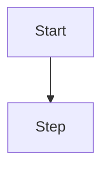
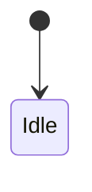

# Engineering Acceptance Pack Template

Copy this file to `temp/engineering-acceptance-<projectKey>-v<n>.md`. Delete
guidance comments. Set each `sections.*.present` honestly; omit the matching
body heading when `present: false`. **Project** content from confirmed Project
Work drafts / companions — do not invent a parallel SoT.

```yaml
---
doc_type: engineering_acceptance_pack
project_key: "" # stable project label / slug
project_id: "" # UUID when known
version: 1
status: draft # draft | pending_acceptance | accepted | superseded
# AI self-check recorded before emit (never a user-facing YAML dump)
init_ai_self_check:
  status: pending # pending | passed | failed
  checked_at: "" # ISO8601 when passed/failed
  findings: [] # empty when passed; codes/messages when failed
sections:
  frameworks_and_libs:
    present: true # software Must be true
    basis: ""
  directory_structure:
    present: true # software Must be true
    basis: ""
  data_structures:
    present: false
    basis: "" # e.g. no_database_declaration | no_json_contracts
  flowcharts:
    present: false
    basis: ""
  uml_diagrams:
    present: false
    basis: ""
  visual_baseline_plan:
    present: true # software Must be true
    basis: "" # required | not_applicable:<reason>
source_project_work_sha256: null # draft or pre-confirm content hash when known
companion_refs: [] # optional [{ slot, file_name, sha256 }]
accepted_at: "" # ISO8601 when status=accepted
accepted_by: "" # user | unattended_grant
html_render:
  status: skipped_markdown_only # ready | tools_missing | error | skipped_markdown_only
  html_path: null
  html_file_url: null # file://…html when status=ready
  markdown_path: "" # absolute path to this pack
  markdown_file_url: "" # file://…md (always for clickable SoT)
  link_emitted: false # true only after Engineering Acceptance Link block shown
  tool_probe:
    pandoc: false
    mmdc: false
    diagram_lua: false
    plantuml: false
  note: "" # when tools_missing: remind local convert is token-free
# HTML preview: markdown-html-acceptance-render.md + render_markdown_acceptance_html.py
# Gate owner: engineering-acceptance-pack.md
---
```

# Engineering Acceptance — `<project_key>` v`<version>`

## Summary

- Project:
- What the user is asked to accept (engineering locks only):
- Visual baseline plan: `required` | `not_applicable` —

## 1. Frameworks and libraries

> Required when `sections.frameworks_and_libs.present: true`.
> Project from `engineering.stack` and `dependencies.approved`.

### Stack

| Layer | Choice | Constraints / notes |
| ----- | ------ | ------------------- |
|       |        |                     |

### Capability-critical libraries

| Capability | Package | Alternatives considered | Rationale |
| ---------- | ------- | ----------------------- | --------- |
|            |         |                         |           |

Or explicit: `no_capability_dependency_declaration` —

## 2. Directory structure and modules

> Required when `sections.directory_structure.present: true`.
> Project from `engineering.directory_structure` and `architecture.modules`.
> Lock roots / ownership / naming — not every leaf file.

### Roots

| Root path | Purpose | Owner module |
| --------- | ------- | ------------ |
|           |         |              |

### Ownership and naming rules

- Ownership:
- Naming:
- Forbidden catch-all names (must remain blocked):

### Modules

| Module id | Responsibility | Owned data | Allowed deps |
| --------- | -------------- | ---------- | ------------ |
|           |                |            |              |

## 3. Data structures

> Include only when `sections.data_structures.present: true`.
> Prefer excerpts or links to registered `data-model.md` /
> `data-contracts.yaml` / `constants-catalog.yaml`.

### Tables / collections

| Name | Fields / shape summary | Attachment |
| ---- | ---------------------- | ---------- |
|      |                        |            |

### JSON / file / constants shapes

```text
# paste durable shapes or link + excerpt
```

## 4. Flowcharts

> Include only when `sections.flowcharts.present: true`.

### `<flow id or name>`



## 5. UML diagrams

> Include only when `sections.uml_diagrams.present: true`.

### `<diagram name>` (`state` | `sequence` | `class` | `er`)



## 6. Visual baseline plan

> Required when `sections.visual_baseline_plan.present: true`.

| Field          | Value                                     |
| -------------- | ----------------------------------------- |
| applicability  | `required` \| `not_applicable`            |
| basis          |                                           |
| next user step | Spec/Shell selection \| skip visual steps |

## Acceptance checklist

- [ ] Frameworks / libraries match Project Work (or explicit none)
- [ ] Directory roots + modules are complete enough to guide later tasks
- [ ] Data structures present or honestly N/A
- [ ] Diagrams present or honestly N/A
- [ ] Visual baseline applicability decided
- [ ] User accepts this pack (interactive) / unattended grant recorded
