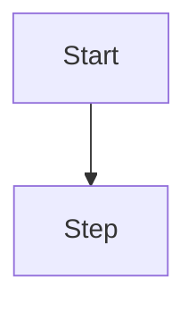
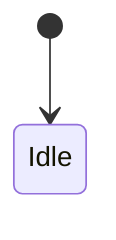

# Milestone Plan Acceptance Pack Template

Copy this file to `temp/milestone-plan-acceptance-<milestoneKey>-v<n>.md` (or
the project’s agreed attachment slot). Delete guidance comments. Set each
`sections.*.present` honestly; omit the matching body heading when
`present: false`.

```yaml
---
doc_type: milestone_plan_acceptance_pack
milestone_key: M1 # project milestone key / id label
milestone_id: "" # UUID when known
project_id: ""
version: 1
status: draft # draft | pending_acceptance | accepted | superseded
# Copy locale — required when sections.user_copy.present is true
copy_locale: zh-Hans # BCP 47; Plan shows only this locale
copy_locale_source: conversation_language # user_explicit | conversation_language
sections:
  user_copy:
    present: false
    basis: "" # e.g. no_user_visible_copy_in_milestone_plan
  data_structures:
    present: false
    basis: ""
  flowcharts:
    present: false
    basis: ""
  uml_diagrams:
    present: false
    basis: ""
  test_cases:
    present: false
    basis: ""
in_scope_task_ids: [] # tasks whose Plan Gate content feeds this pack
source_plan_paths: [] # Task Work Plan paths or attachment logical ids
accepted_at: "" # ISO8601 when status=accepted
accepted_by: "" # user | unattended_grant
html_render:
  status: skipped_markdown_only # ready | tools_missing | error | skipped_markdown_only
  html_path: null
  html_file_url: null # file://…html when status=ready
  markdown_path: "" # absolute path to this pack
  markdown_file_url: "" # file://…md (always for clickable SoT)
  link_emitted: false # true only after Plan Acceptance Link block shown
  tool_probe:
    pandoc: false
    mmdc: false
    diagram_lua: false
    plantuml: false
  note: "" # when tools_missing: remind local convert is token-free
# After acceptance: Execution/Delivery Must keep this file as the primary
# milestone alignment reference (see milestone-plan-acceptance-pack.md).
# HTML preview: markdown-html-acceptance-render.md + render_markdown_acceptance_html.py
---
```

# Milestone Plan Acceptance — `<milestone_key>`

## Summary

- Milestone:
- Plan locale (`copy_locale` / source):
- In-scope tasks:
- What the user is asked to accept:

## 1. User copy (`copy_locale` only)

> Include this section only when `sections.user_copy.present: true`.
> Design strings in the selected locale. Do **not** list other locales here;
> those are Execution work.

| Key / surface | State / trigger | Copy (`copy_locale`) | Task | Notes |
| ------------- | --------------- | -------------------- | ---- | ----- |
|               |                 |                      |      |       |

## 2. Data structures / schema

> Include only when `sections.data_structures.present: true`.

### Tables / collections

| Name | Change | Fields / shape | Task |
| ---- | ------ | -------------- | ---- |
|      |        |                |      |

### JSON / file / constants shapes

```text
# paste durable shapes or link + excerpt
```

## 3. Flowcharts

> Include only when `sections.flowcharts.present: true`.
> Prefer Mermaid `flowchart`; one subsection per task or shared flow.

### `<task_id or flow name>`



## 4. UML diagrams

> Include only when `sections.uml_diagrams.present: true`.
> State / sequence / class / ER only when Plan actually authored them.

### `<diagram name>` (`state` | `sequence` | `class` | `er`)



## 5. Test cases

> Include only when `sections.test_cases.present: true`.
> Aggregate per-task Verification Test Cases; keep Traces to Analysis Outcomes.

### `<task_id or title>`

| ID  | Kind | Case | Traces to | Expected |
| --- | ---- | ---- | --------- | -------- |
|     |      |      |           |          |

## Acceptance checklist

- [ ] Selected locale copy is complete for Plan scope (or N/A)
- [ ] Schema / data shapes match intended Plan disposition (or N/A)
- [ ] Flowcharts cover Operation Flow for Gate-required tasks (or N/A)
- [ ] UML diagrams are only those that help implementation (or N/A)
- [ ] Test cases trace to Analysis Outcomes (or N/A)
- [ ] User accepts this pack (interactive) / unattended grant recorded
